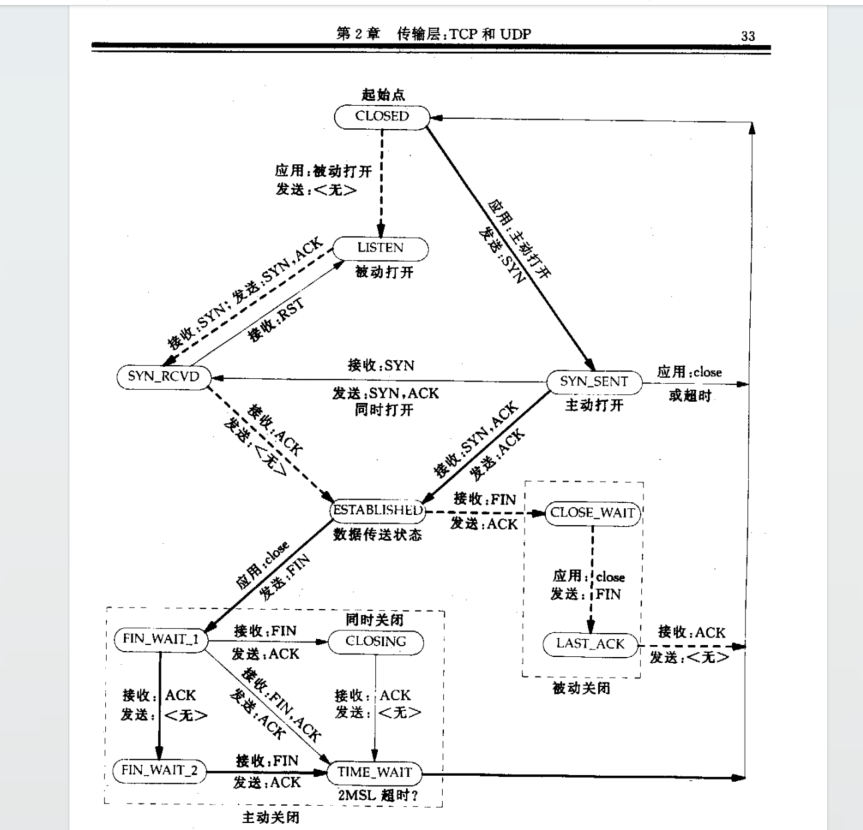
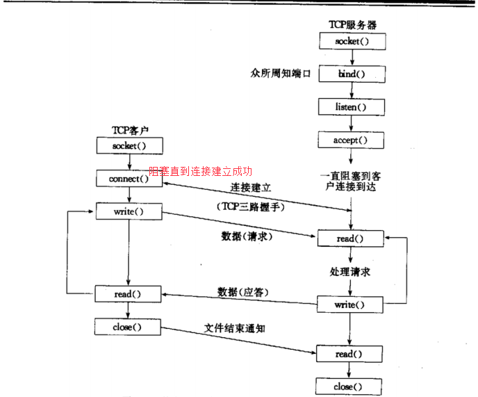
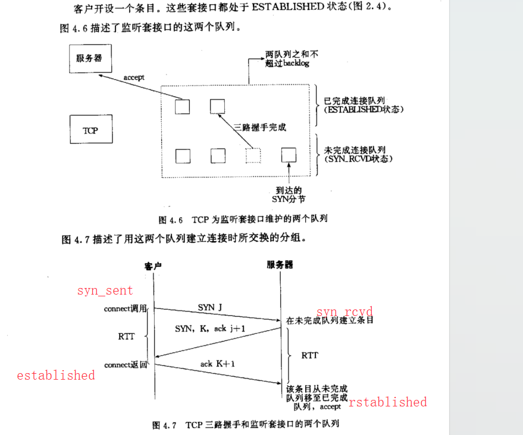
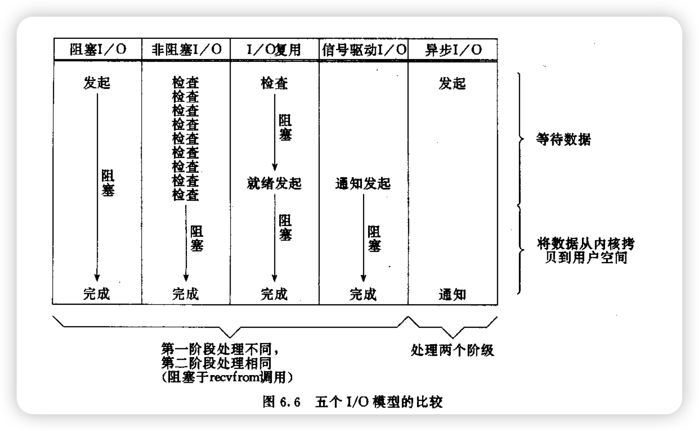
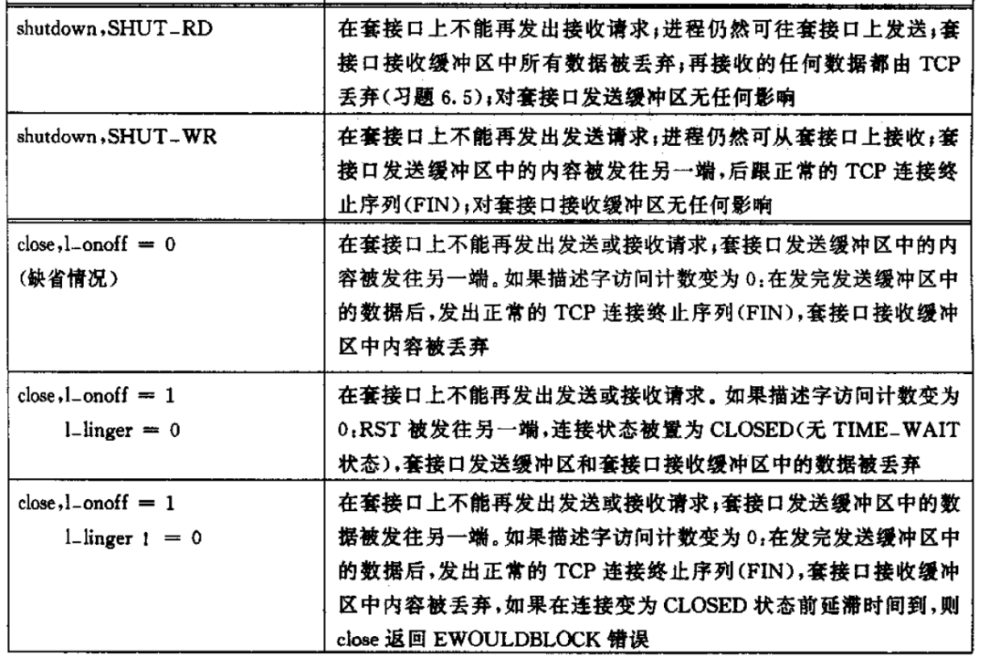

# C++

## 虚函数

## 智能指针实现

## c11新语法

# 分布式存储

## leveldb

## daos

## GFS

## ceph

## WAS

## 各种存储的类比

# 总结

对于存储来说有三个最重要的问题：1、数据怎么存 2、数据怎么取 3、数据怎么保证一致
问题1、一般来说设计都大差不差，都是用一大块空间存储数据，然后用其中的一小块空间去标识这些数据的起始地址、校验和、是否压缩等等信息
问题2、决定了为了高效安全的读取写入后的数据，我们需要额外的空间去记录数据的“索引信息” -- 其实本质上就是一种空间换时间
问题3、决定了对于块存储来说，选择何种接口决定了数据一致性的做法，如果是对上层提供追加写，那么；如果提供的是原地覆盖写

元数据有两种设计方式：

# 中心化设计

## GFS

所有的元数据保存在一个中心化的存储节点或者集群中
tablet服务器上存储一些

### 面试问题

1、GFS 如何保证数据的高可用？遇到错误如何进行重试？
https://blog.csdn.net/qq_40229166/article/details/126652532
元数据一致性：文件系统的名字变更是原子的。所有的操作都会记录类似wal的东西并且会定期记录checkpiont(我理解就是快照)，掉电后，加载快照，然后从快照点开始顺序应用日志 -- 除此之外会做一个备份服务器避免主服务器崩溃 -- 设计缺陷
GFS崩溃了怎么保证数据一致？
GFS不保证数据强一致，特别是写入失败和并发写入的情况
并发写入是非一致但是定义的,GFS只保证写入顺序，不保证是否有冗余数据
保证追加写是原子的，做法是如果检测到跨chunk的写，就填充并且写一个新的chunk
client1：ABCD  client2: EFGH
AEBFCGDH

跨chunk边界的IO会主动填充，到另一个chunk去写
GFS的数据一致性很差，极端情况下，可能会有重复的数据被反复追加
这个时候就需要应用去做处理保证数据一致性：应用定期打快照，并且记录校验和

GFS io路径
->去master找到chunk handler（哪个tablet server 的哪个chunk） + 偏移

### 元数据设计

元数据类型：

1. 集群元数据：目录结构、inode、集群视图保存在master
2. 本地存储元数据，查找chunk对应文件的关系，chunk和chunkserver的关系，存在对应chunkserver上，内存里维护一份
3. 存储后端元数据：由chunkserver的文件系统管理

chunk大小64M

1. 64M条目对应一条64k的元数据，这样整个集群的元数据比较小，能够放到内存里
2. 减少io路径上的rpc交互，具体chunk的handler信息基本缓存在客户端
3. 缺点：对应块容易成为瓶颈、比如并发写某一个块

### 数据一致性设计

集群元数据的一致性设计：

1. 文件系统元数据：对目录的修改会按照目录的级别顺序上锁
2. 元数据操作会记录wal，便于崩溃恢复
3. 对应chunk元数据，视图变更或者未收到心跳的时候，主动去对应节点同步最新的信息
4. master服务器会有从进行备份、崩溃之后需要人工恢复(从这里看是有可用性问题的)

外部手段：巡检，定期检测没有引用关系的块，读写流程中对对应数据检查校验和，对数据不一致的chunk副本，让其primary退位，并且从其他节点同步正常的数据

# 去中心化设计

# Ceph

ceph io路径(rbd)

ceph怎么保证数据一致性
离线巡检

crush算法
ceph的元数据设计：
osd的元数据: 有多少pg，每个pg的日志应用到哪了
集群元数据，视图这些需要保存在mds里
但是IO路径的设计上，只需要一个索引，通过这些索引计算出来属于哪个pg的osd(代价是需要额外的元数据索引空间记录这些映射关系，好让请求发过来的时候能够知道应该写哪些块的哪些位置)，然后具体发到某个节点后

### 元数据设计

1. 对于集群元数据存在MDS(GFS有可用性问题)，pg osd视图
2. 但是其中，某个obj属于哪个pg的osd这类跟IO路径强相关的元数据，采用crush算法计算得出，因此集群的整体性能瓶颈不再受元数据集群的带宽限制、每个节点可以利用自己的cpu，通过crush算法算出相同的结果
3. 本地存储元数据：本地的osd模块会存一份，直接存在rocksdb里
4. 存储后端元数据(和本地存储元数据合并了)：以bluestore为例子，他直接管理裸盘，lba到具体obj的映射，存在rocksdb里；直接通过文件系统读写文件，有明显的系统瓶颈

### 数据一致性设计

1、mds集群存储集群元数据(paxos)
2、对比rados的数据复制算法和raft数据复制算法：

1. 都是基于日志完成副本数据的一致性保障的，每个节点都需要一个完整，连续的日志记录来保证。
2. Rados不需要leader选举，其master是通过crush算法确定的，一些情况下需要一个临时的master完成恢复和对外服务。Raft需要一个Leader选举的过程，这个过程可能需要一定的时间（可能多次选举才能成功）。
3. rados由于记录的pg log日志粒度比较粗，并且只记录操作的元数据，导致数据完成一致性恢复的时间可能比较久。Rados采用了2个步骤：peering完成只是pg完成了数据一致性的协商，pg clean状态才是rados的pg真正完成数据一致性的时间点。这导致在数据恢复阶段的状态机异常复杂，实现难度较大。
4. rados其实在底层的对象存储（Filestore或者Bluestore）都有详细的日志（操作的元数据和数据），而该日志是基于object store存储引擎的，而不是基于pg的日志。也就是说object store的日志里存放的是该osd上的所有pg的日志，具体日志的truncate也是本地自己完成的。Rados并没有利用object store的日志来完成恢复，而是利用pg log来恢复。

# Daos

daos的io路径
daos怎么保证数据一致性
一致性哈希算法

# 阅读对比过GFS、CEPH、DAOS的论文，对其中的元数据设计有一定的了解

这个怎么回答

# leveldb

 mvcc的作用
 compations的机制

# 其他面试问题：

1. 文件系统 open 函数执行时，背后从上层到底层发生了什么https://zhuanlan.zhihu.com/p/371574406
2. 为什么要设计MSS： https://www.zhihu.com/question/19790398
3. TCP：慢启动、拥塞避免、快恢复、快重传：https://blog.csdn.net/ydyang1126/article/details/72842274
4. 协程介绍
5. leveldb mvcc
   https://blog.csdn.net/qq_35423154/article/details/123957586

面经：
https://zhuanlan.zhihu.com/p/365565149?ivk_sa=1024320u

# 共识算法

## paxos

## multi-paxos

## raft

# 算法

# 存储介质特性

## HDD特性

## SATA SSD

## NVME SSD

# 块存储协议类型和基本原理

## ISCSI

## NVMF

# 计算机网络

## 三次握手四次挥手

为什么TIME_WAIT要等2MSL

TCP四次挥手的过程中，TIME_WAIT状态的存在和持续2MSL（Maximum Segment Lifetime，最大段生存时间）的原因是为了确保TCP连接的可靠关闭。这个阶段有两个主要的目的：

1. 确保最后一个ACK报文能够被对方收到。如果A发送完最后一个ACK后立即关闭，如果此ACK丢失，那么B没有收到ACK，会重新发送FIN，A如果此时已经关闭，B就会收到一个RST响应，B会认为连接异常终止，而不是正常终止。
2. 避免"老的重复分段"对新的连接产生干扰。由于网络中可能存在延迟的报文，如果立即关闭，那么这些延迟的报文在新的连接中可能会被误认为是当前连接的报文，从而引发错误。

如果不等待2MSL，就可能会有上述的问题。这是为了保证TCP的可靠性和数据的完整性。

状态变更图：

## 网络编程函数

### connect

    1、connect函数的阻塞行为取决于你使用的套接字是否设置为非阻塞模式。在默认的阻塞模式下，connect函数会阻塞直到三次握手完成或者出现错误（如超时）。这意味着如果你在一个应用中调用了connect函数，那么该应用会停止执行，直到connect函数返回。然而，你也可以设置套接字为非阻塞模式。在非阻塞模式下，connect函数会立即返回。你可以使用select、poll或者epoll等函数来检查连接是否已经建立。如果connect函数返回EINPROGRESS错误，这意味着连接正在进行中，你需要稍后再检查连接状态。总的来说，connect函数默认是阻塞的，但你可以通过设置套接字为非阻塞模式来改变这种行为。

2、如果收到RST报文、表示服务端没有进程监听目标端口，客户端返回ECONNECTREFUSTED

### bind

    获取绑定的 IP 地址和端口号：你可以使用 getsockname 函数来获取套接字绑定的 IP 地址和端口号。这个函数会将套接字的地址信息填充到一个 sockaddr 结构体中，你可以从这个结构体中读取 IP 地址和端口号。请注意，IP 地址和端口号都会以网络字节序的形式返回，你可能需要使用 ntohs 和 inet_ntoa 等函数将它们转换为可读的形式。

### accept

    accept 函数在网络编程中用于接受一个连接请求，它并不直接控制内核为套接字分配的缓冲区大小。accept 函数从监听套接字的等待连接队列中取出第一个连接请求，创建一个新的已连接套接字，并返回一个指向这个新套接字的文件描述符。

参数 backlog 与 accept 函数有关，但它不控制缓冲区的大小。backlog 参数指定了监听套接字的等待连接队列的最大长度。这个队列包括了那些已经完成三次握手但是还没有被应用程序通过 accept 调用接受的连接。如果队列已满，新的连接请求可能会被拒绝。

内核为每个套接字维护两个缓冲区：一个接收缓冲区和一个发送缓冲区。它们的大小通常由系统默认值决定，但可以通过套接字选项 SO_RCVBUF 和 SO_SNDBUF 使用 setsockopt 函数进行调整。

总结一下：

* backlog 控制的是传入连接请求队列的最大长度，而不是缓冲区的大小。
* 套接字缓冲区的大小是分别由 SO_RCVBUF 和 SO_SNDBUF 套接字选项控制的。
* accept 函数用于从监听队列中接受一个连接请求，创建一个新的已连接套接字。
  

## IO多路复用

### 五个IO模型

1. **阻塞I/O（Blocking I/O）** ：这是最常见、最传统的I/O模型。在这种模型中，一个I/O操作会使得进程进入阻塞状态，直到操作完成。例如，当一个进程发起一个read操作后，它必须等待数据准备就绪并被复制到用户空间后才能继续执行。
2. **非阻塞I/O（Non-blocking I/O）** ：在这种模型中，I/O操作不会使得进程阻塞。如果数据没有准备好，I/O操作会立即返回一个错误，进程可以继续执行其他操作。进程需要不断地主动轮询来检查I/O操作是否完成。
3. **I/O复用（Multiplexing）** ：I/O复用是一种允许一个进程同时监视多个I/O事件、在任一事件就绪时通知进程的机制。当进程被通知时，它会启动相应的I/O操作。I/O复用通常使用select、poll或者epoll等系统调用实现。
4. **信号驱动I/O（Signal-driven I/O）** ：在这种模型中，进程可以使用sigaction系统调用来启动一个操作并立即返回，操作完成时会发送一个信号通知进程。这种模型可以看作是一种"半异步"模型，因为实际的I/O操作（如数据的复制）仍然是阻塞的。
5. **异步I/O（Asynchronous I/O）** ：在异步I/O模型中，进程发起I/O操作后可以立即开始执行其他任务，当I/O操作真正完成时，进程会收到一个信号或者其他形式的通知。这种模型是真正意义上的异步模型，因为I/O操作（包括数据的复制）都不会阻塞进程。

   

### fd读写就绪的条件

套接口"读准备"好的条件：

1. 套接口读缓冲区中的数据子节数大于等于最低水位线(low water mark),此时读套接口不阻塞直接返回一个大于0的数（准备好读入的数据量），可以用套接口选项SO_RCVLOWWAT来设置，tcp和udp默认设置为1
2. 连接的读着一半关闭，也就是收到了对端发来的FIN，此时表明后续无数据会发，对此套接口的读都不阻塞且返回0
3. 套接口是一个监听套接口，即accept的套接口，且此时连接完成的链接个数不为0
4. 套接口有一个错误待处理，此时不阻塞且返回-1，errno被设置，且可通过getsockopt+SO_ERROR获取并且清理错误码

套接口"写准备"好的条件：

1. 套接口发送缓冲区的内容大于等于发送缓冲区最低水位线，可以用套接口选项SO_SNDLOWWAT来设置，tcp和udp默认设置为2048
2. 套接口写这一半关闭，此时再向此套接口写将触发信号SIGPIPE
3. 套接口有一个错误待处理，此时不阻塞且返回-1，errno被设置，且可通过getsockopt+SO_ERROR获取并且清理错误码

### 关闭连接

close和shutdown

### select、poll、epoll优缺点以及对比

`select`、`poll`和 `epoll`都是Linux系统提供的I/O复用机制，它们都可以让一个进程同时处理多个I/O事件。但是它们的工作方式和性能特性有所不同：

1. **select**
   **优点** ：select模型支持跨平台，包括Windows，Linux和Unix，使用广泛。
   **缺点** ：

   * 第一，每次调用select都需要遍历整个fd集合，当fd数量大时，效率较低。
   * 第二，select支持的文件描述符数量有限。在Linux中，这个数量通常默认为1024，可以通过修改宏定义和重新编译内核来提高这个限制，但仍然不够灵活。
   * 第三，select使用的参数是值-结果参数，每次调用后都需要重新设置。
2. **poll**
   **优点** ：poll没有最大文件描述符数量的限制，因为它是基于链表来存储的。
   **缺点** ：

   * 第一，和select一样，poll每次调用也需要遍历整个fd集合，当fd数量大时，效率较低。
   * 第二，同样也是值-结果参数，每次调用后都需要重新设置。
3. **epoll**
   **优点** ：

   * 第一，epoll只会对"活跃"的文件描述符进行操作，因此在处理大量文件描述符时，它的效率更高。
   * 第二，epoll没有最大并发文件描述符的限制。
   * 第三，epoll使用的是事件的就绪通知方式，通过回调函数来进行处理，只有真正的读写事件发生的时候，才会通过线程唤醒机制唤醒相应的读写线程。

   **缺点** ：epoll是Linux特有的，不具备跨平台性。

 **历史和原理对比** ：

* `select`是最早的I/O复用机制，它的主要问题是效率和可扩展性。因为它需要遍历整个文件描述符集，所以当文件描述符数量增加时，效率会降低。此外，它支持的文件描述符数量有限。
* 为了解决这些问题，`poll`被引入。poll使用链表来存储文件描述符，因此没有最大文件描述符数量的限制。但是，poll仍然需要遍历所有文件描述符，所以效率仍然不高。
* 最后，`epoll`被引入。epoll只对就绪的文件描述符进行操作，因此在处理大量文件描述符时，它的效率更高。此外，epoll使用事件通知而不是轮询，进一步提高了效率。但是，epoll是Linux特有的，不具备跨平台性。

# 操作系统

## 内存

1. 内存模型
2. 内存页面管理
3. 缺页类型：major fault和minor fault：major fault是物理内存里也没有；minor fault是物理内存有这个地址，但是已经被操作系统归还了，不属于这个进程可使用范围，这个时候入锅这个虚拟机地址刚好被申请，那么就会重新分配物理内存，更新页表项(也就是虚拟机内存到物理内存的映射关系)
   参考：https://www.cnblogs.com/binlovetech/p/17918733.html
4. 大页

# 计算机组成原理

# 一些基础组件实现

## 线程池

任务队列、线程woker、线程池

任务队列的要求：

worker类：

run、init、stop

线程池类：

init、submit_req

## 内存池

## 设计模式

# 性能

# SPDK

spdk提供一个完全在用户态的nvme驱动，并且能够利用多核的优势，提供高性能无锁、免拷贝的IO流

## 块设备层接口的使用

在项目中，我们主要是用blobstore层的接口做类似ceph的存储后端模块，然后自定义block层对接客户端模块nvmf/iscsi模块，也就是对客户端来说我们提供一个nvmf的

blobstore - bdev - 具体块设备

整个块设备层被抽象成bdev模块，具体来说就是根据不同类型的磁盘设备，初始化blobstore和bdev模块时，将注册不同的IO处理流程的回掉函数，只有对nvme协议的盘提供用户态驱动(即先从linux内核往unbind文件里写1解绑、然后绑到uio)、其他HDD之类的都会走aio bdev，最终会通过libaio的io_submit异步提交io

## spdk reactor模型和无锁设计

整个IO路径遵循了run to competion设计，一个IO会经可能的在一个线程上处理，并且避免数据拷贝和锁的使用

1、iochannel的设计类似网络协议栈
|--blobstore层需要的信息--|--bdev层需要的信息--|io buffer|，在最上层就会组装好，在整个io到驱动层到盘上，不会进行上下文切换、和内存拷贝

## 零拷贝和DPDK的关系

所有传给spdk的buffer都需要用[spdk_dma_malloc()](https://spdk.io/doc/env_8h.html#ac9b56bdbcfeeebe6ad61eb574c823268 "Allocate a pinned memory buffer with the given size and alignment.")也就是DPDK的接口申请
也就是说所有的buffer通过dma读取
